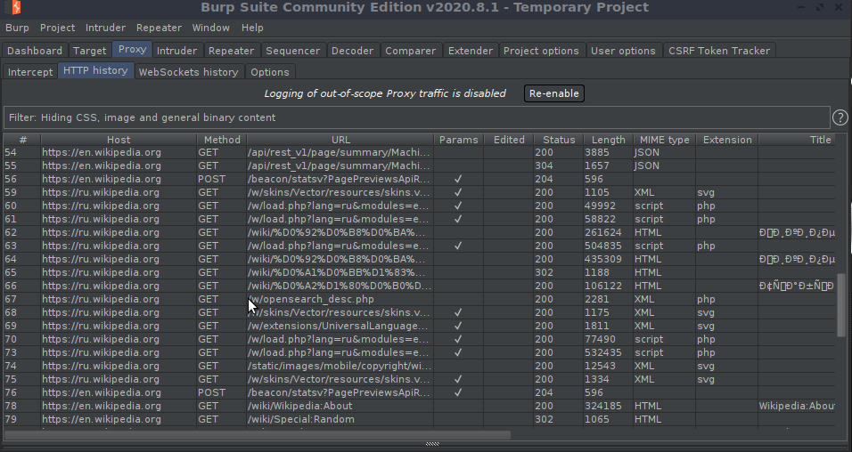

# BHParse 

**Parse BurpSuite-Proxy Generated XML (intercept history) files into html.**   

```  
Domain.com
 |
 |--- index.html
 |--- files
       |--- reportfiles.html......
```  

* Open index.html in your browser. It contains all the result. 
* For more details on each request click on "Click!" button.  
* You can also search for specific type of url/path/file/status/mimetype etc. 
* StaticFiles.zip contains JS library files (jQuery, datatables).  

**Installing requirements :**  

```shell 
pip3 install -r requirements.txt
```  

**Usage :**

```shell     
usage: bhparse.py [-h] file

positional arguments:
  file        XML file generated by BurpSuite

optional arguments:
  -h, --help  show this help message and exit
```  

```shell   
./bhparse.py BurpProxy.xml  
```   

**Auto Completion :**  

After typing `bhparse` press Tab button to list all xml files within folder.  

**Example :**  

* Intercepting communication with Burp and Saving xml file : 



* Parsing xml file with `bhparse.py`  

 

* Output result (index.html file) :  

 
